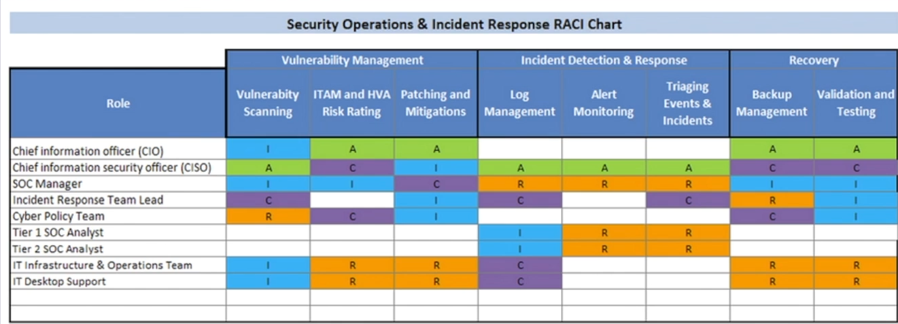
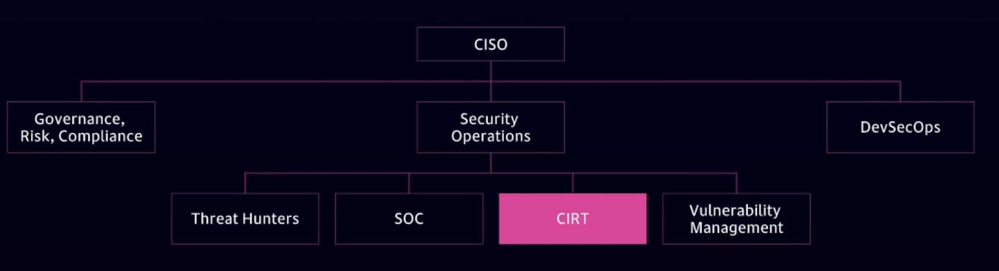

# Preparing an Organization for a Cyber Incident

## Why do I need an incident response plan?

- You need to plan ahead so you know how to respond in the midst of an attack. Have playbooks, practice them.

- All org have risks associated with InfoSec and data privacy

- Plans must be tailored depending on the risk profile and threats to the organization

- Regulations and/or insurance companies may require it

- It is good business

- A good IR plan will reduce the impact and costs of security incidents

- Most organizations lack organic IR capabilities and don't have much experience dealing with a security incident

- Creating a plan forces a dialog about staffing, budgets, capabilities, tools and processes

## Questions Executives ask during an incident

- Now what ? What does that mean to me ? What do I need to be awared of  ?

- What should we disclose / what are we required to disclose ? You need to know who you need to respond to, what you have to tell and during what timeline.

- How much will this cost ? 

- What did the attackers take ? 

- How did they get in ?

- What will it takes us to get IT back to full operations ? 

- What else don't we know about ? 

- How could we have prevented this and how do we make sure this never happens again ? 

- How could we have been better prepared ? 

- Who were the attackers ? What were their motivations ?

## Questions an organization should focus on while making an IR plan

- What people and skill-sets do we need and how do we organize the IR function ? Do we need to hire for that skill or contract that out or have outside consultants to help you with that ? 

- What technology and tools do we have access to ? Do we have a SIEM, EDR, IDS, IPS, full packet capture ?

- What mechanism exists to use lessons learned to better secure us ? Do we have a weakness in our defense in depth, do we have an employee who is always clicking links ? Identify low hanging fruits within your organization.

- How do we manage IR in our organization ? 

## How do you define an "incident" ?

~~We know it when we see it !~~ 

- Event : Something that happens on information systems (not required to be malicious or requiring action). Ex: successful login

- Alert : Something potentially actionable. Ex: notification of malware on a device

- Incident (small i): Violation of CIA without a business impact

- Incident (capital i): Violation of CIA with business impact

- Breach : Loss of specific regulated data that triggers legal obligations above and beyond IR

## Maturity of IR capabilities

Low Maturity / No Real Capabilities : Ad hoc IR "reimage the system and move on" , no specific tools or full-time IR staff

Moderate Maturity : IR team, some tools, most likely EDR, FW, IDPS, SIEm, basic processes and playbooks defined

Mature Maturity : Full-time IR team, senior staff, executive sponsorship, funded, repeatable processes, high visibility into endpoints and network, continuous monitoring, threat hunting, forensics, reverse-engineering, pen testing, security orchestration, automation and reponse (SOAR) 

## Strategic Parts of an IR plan 

- What is the mission of the IR team ? How you allign with your org, how you protect them ? 

- Strategy and goals ? 

- Metrics for IR 

- Roadmap for maturing the IR capabilities

- Organizational structure of IR team and how it fits within the broader business/mission 

## Tactical Parts of an IR plan

Typical components of an IR plan may include some or all of the following: 

- Terminology
- Command and control
- Declaring and incident and notifications
- IR team roles and responsibilities
- Triage of incidents
- Command center / war room
- Status update and communications
- Alternate communications
- Decision to disconnect
- Recovery, lessons learned and after action reports

## Writing the plan 

- Don't make your plan W.O.R.N. (Written once, Read never)

- Plans should be updated at least annually

- Use appendices for rosters, references and checklists

- Make the plane simple to read 

- Consider where the plan is stored (hard copy, virtually, version controlled,etc) Make it secured, consider hard copy. 

## Framworks 

- NIST Incident Response Framework :

=> Preparation => Detection & Analysis <=> Containment Eradication & Recovery => Post Incident Activity => 

- SANS Incident Response Framwork : 

1. Preparation
2. Identification
3. Containment
4. Eradication
5. Recovery
6. Lessons Learned

## IR team access

- What privileged accounts does your IR team need in your enterprise ? 

- What will the policy be for use of elevated privileges ? 

- Does the IR team need access to applications, systems, databases, switches/routers/firewalls, ... ? 

- How is the IR team's access to systems monitored ? 

- Who is watching the watchers ? How the IR team is using their credentials ? 

## Common Stakeholders for IR 

- Chief Executive
- Human Resources (promotion/demotion access to data, incider threats ) 
- Information Technology (solid partnership with IT) 
- Board of Directors (CISO gets in front of the board)
- Customers/Clients
- Legal
- Communications/Public affairs
- Auditors

## Policy and Executive Engagement is Required

Written policy is necessary across the enterprise to give security the authority and necessary visibility

Examples:

- Logs must be forwarded to the SIEM, new software being developed needs requirement of generating logs

- Agents shall be installed on systems for Continuous Monitoring (CM) as prescribed by security

- Internal firewalls and other mechanism must not block security's ability to monitor, detect, respond and recover from an incident

Shadow IT organizations will most likely push back on additional monitoring and control by security, be prepared.

Executive leadership must understand the business/mission reason to provide adequate support

Stakeholer engagement is necessary to ensure:

- Agents and activity do not cause an unreasonable business/mission impact
- Understand compliance necessity and legal/regulatory requirements

## Example Regulations

- PCI DSS (payment card industry) 
- HIPAA (medical informations)
- FISMA (federal us gov informations)
- NERC-CIP (utilities and critical infrastructures)
- California SB 1386 (california state wide cyber requirements)
- NYS DFS 500 (new yok state wide cyber requirements)
- SEC (plenty of regulations regarding cyber)
- GDPR (EU cyber laws, implications world wide)

## Legal Considerations

- Disconnect vs "Watch and Learn"
- Contacting law enforcement
- Evidence chain of custody
- Retention of records
- Privacy considerations and employee acceptable use policies

## Cyber Incident Response Team (CIRT)

- CIRTs can range from 1 person to multiple
- May be on premise or virtual (or a combination) 
- Can sit in a number of places within an organization
- May be 24x7 or just during normal working hours
- May be a joint effort between in-house resources and contractors, consultants or an Managed Security Service Provider (MSSP) 

## Common CIRT Member Skillsets

- Malware Reverse Engineering
- Threat Intelligence
- Network Forensics
- Threat Hunting
- Scripting / Coding
- Digital Forensics

## RACI for IR 

Responsible - Accountable - Consulted - Informed

Who is responsible ? Who is accountable ? Who is consulted ? Who is informed ? 

## Security Operations Center (SOC) and IR 

- It is not advisable to have CIRT sit completely within the SOC, otherwise monitoring may stop during an incident

- Cross-training and rotations are highly encouraged

- SOC and CIRT acting as peers or having some limited overlap is best practice 

- If only one CIRT member, focus on updating plans and contract engagements

## Examples CIRT organizations charts

![[otherposchart.png]]

### Business Decision

- There is no "right answer" for the size, capabilities or organizational structure of CIRT 

- Ultimately, it is a business decision based on risk appetite, available funding, requirements and strategy

## Hybrid and External Resources

- Many organizations are shifting to a hybrid CIRT due to increased complexities and difficulty recruiting and retaining staff

- Organizations often will have an IR retainer with an outside company

- Cyber Insurance is becoming common and generally offers IR retainers at discounted places

- Without a retainer, organizations may find it difficult to hire a firm and get them engaged quickly

## Using RACI for external IR firms

- Remember RACI and if you use external firms, account for their roles and responsabilities

- Make sure RACI is deconflicted with Service Level Agreements (SLAs) and contractual requirements 

