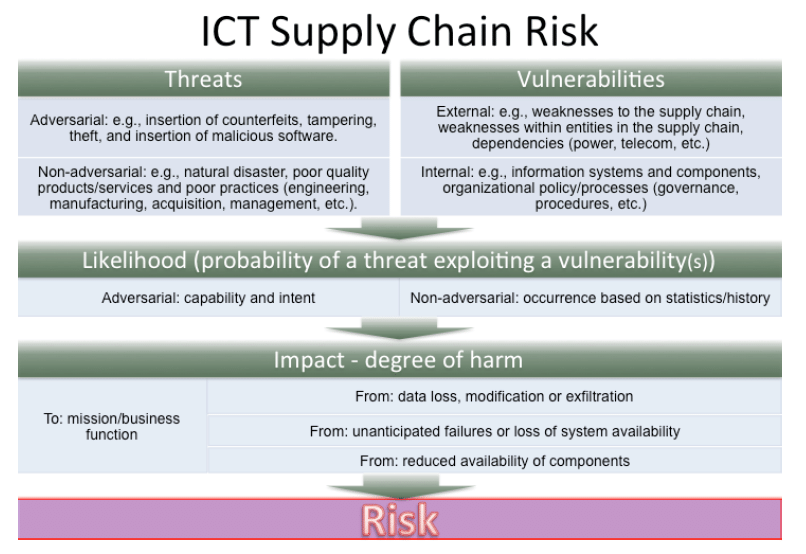

# Identifying Organizational Assets and Risk

## How much risk is acceptable ? 

How much risk are we willing to take ? 
What is the risk vs benefits tradeoff that we are looking at ? 
What is the appetite of risk within the organization ? 

### Enterprise Risk Management (ERM) 

- Organizations often don't include IT / Security risk into ERM discussions

- CIOs / CISOs need to have a "seat at the table" when discussing enterprise risk

- Often this lack of involvement is due to poor executive communication skills from security leadership

## CIRT Linkage to Business Continuity

- CIRT and Business Continuity Planning (BCP) / Disaster Recovery (DR) must be interconnected

- DR / BCP plans should include recovery from large cyberattacks

- Recovery Time Objectives (RTO) and Recovery Point Objective (RPO) need to be understood by CIRT 

## IT Risk Register Example

## Risk Management Data Sources

Data from risk assessment and intelligence:

- POA&MS
- Known Vulnerabilities
- Unmitigated Risk
- Security Controls
- Threat Intelligence
- Human Capital

Needs to be englobed within the enterprise risk

## High Value Assets (HVA) 

Most organizations don't do a good job to identify what is an HVA for them. 

What are the assets in those applications that would be detrimental for the organization if they went down ?

How may your assets be impacted by cyber incidents ? 

You can't control or protect what you don't know is out there.

## IT Asset Management (ITAM)

- Comprised of both hardware asset management and software asset management

- Criticality of systems should be taken into account

- DR/BCP and RTO/RPO objectives should be included

- Mature Change Management Database (CMDB) with clear linkages to other systems is necessary

## Accurate Information

- CIRT needs access to updated network diagrams

- CMDB information

- System security plans

- Vulnerability scanning results

## Understand Risk and Risk Appetite

Risk is not an IT security Decision, it is business' executives.
But you want to make sure that these issues and risks are being elevated to executives. 

- The CIRT leadership should understand the risk appetite of the organization

- CIRT should be involved in patch management and vulnerability management processes

## Risk Assessments

- If the organization has a risk assessment, CIRT should be familiar with the document and known threats/risks identified

- Examples may be the NIST Cybersecurity Farmework (CSF), Risk Management Framework (RMF)

- NIST 800-30 Guide for Conducting Risk Assessments

## Threat Intelligence Helps You Understand Something Fundamental

## Open Source Threat Intel

- https://www.abuse.ch
- https://www.dshield.org
- https://rules.emergingthreats.net
- https://www.shadowserver.org

## Supplay Chain Risk Managmenent

(SCRM) is a discipline that addresses the threats and vulnerabilities of commercially acquired information and communications technologies - MITRE

## Insider Threats

- Negligent Insiders: Those that through misconfiguring things, not following policies or by doing things create unnecessary risk. They are a threat to the organization but their intent was not to cause harm or steal information or anything like that.

- Criminal Insiders: Those that are knowingly, intentionnaly going for informations or data or access they shouldn't have or try to destroy things that would be considered a crime.

- 62% of insider threats are negligent insiders

- 14% of insider threats are criminal insiders

Rigor and structure and chain of custody are very important when working on insiders threats.

## How IR Teams Manage Insider Threats

- Don't wait until you have an insider threat to figure this out

- Develop a foundation and discuss with executives and stakeholders what insiders threats are, what you doing to be prepared for them, how you monitor for them, and who and how would we handle it ?

- Identify high-risk employee segments and activities - develop personas 

- Develop a business case

- Build the structure and processes

- Develop monitoring and investigation protocols

## Insider Threat Program Considerations

- Consider an Insider Threat Working Group

- Collaborate with HR / Legal closely

- Build insider threat indicators

- Ensure notifications between IT, HR and Cyber

- Have a reporting structure that allows for bypassing the chain of command when necessary 

## Example Insider Threat Indicators - Non Technical

- Work performance decline
- Increased absenteism
- Increase in violation of company policies
- Foreign travel
- Suspect social media posts 
- Overuse of words that express negative emotions
- Sudden and unexplained increase in wealth
- Demonstrating ties to high-risk people or organization

## Example Inser Threat Indicators - Technical

- Introduction of unauthorized devices (USB,etc.)
- Installing unauthorized software
- Attempt to increase privileges
- High printing volume
- Access during non-standard time
- Unusual network traffic
- Excessive uploads/downloads
- Accessing prohibited websites
- Accessing systems without authorization

