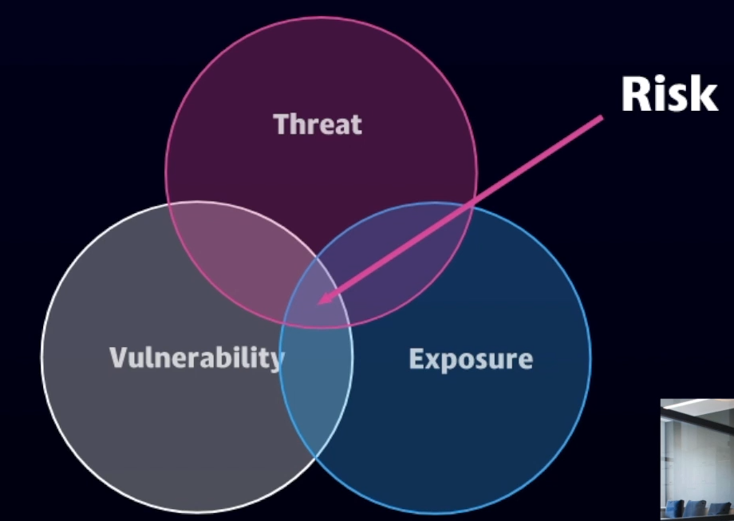

# Protecting an Organization from a Cyber Incident

## Effective Cyber Defense Requires Organization

Incident responders need access to critical information including:

- Updated network diagrams
- Ports and protocols documentation
- Baselines / Gold images
- Configuration files

Secure & Hash configurations, have backups and baseline images and  store hashes in a different locations to make sure attackers can't get their hands on.

## Risk Based Approach to Vulnerability Management

## Drilling Down on Vulnerability Management

## IR Teams Need Real-Time Data on Vulnerabilities in the Environment

## High Value Assets (HVA)

Of the vulnerabilities in my enterprise with exploits, let's target high values assets first.
Make sure that we know what our critical assets are that have vulnerabilities that can be exploited that we need to be paying attention to.

## How Mature Vulnerability Management Helps IR

- Visibility into vulnerabilities within the enterprise (eg. scanning)
- Scoring system that is understood and written in policy
- Layering on risk and HVAs to target remediation
- Patch management and automation
- Metrics
- Third party applications

## Center for Internet Security (CIS) Top 20

https://www.cisecurity.org/controls/

- Mappinps available to NIST CSF, FISMA, ICS, etc.
- Benchmarks available
- Automated tools available to check compliance

## NIST Cybersecurity Framework (CSF) 

- Designed to be customized
- Risk based catalog of cybersecurity
- Evolves faster than legislation and regulation
- Can be updated as threat change

## Five core functions of the CSF: 

### Identify: What processes and assets need protection?

- Asset Management
- Business Environment
- Governance
- Risk Assessment
- Risk Management Strategy
- Supply Chain Risk Management

### Protect: What safeguards are available? 

- Identity Management, Authentication, Access controls
- Awareness & Training
- Data Security
- Information Protection Processes & Procedures
- Maintenance
- Protectice Technology

### Detect: What techniques can identify incidents?

- Anomalies & Events
- Security Continuous Monitoring
- Detection Process

### Respond: What can mitigate impact of incidents?

- Response Planning
- Communications
- Analysis
- Mitigation
- Improvements

### Recover: What techniques can restore capabilities? 

- Recovery Planning
- Improvements
- Communications

## CSF Tiers - Self Assessment

## NIST 800-53 Security & Privacy Controls

- Typically used for the US federal government
- Includes families of security & privacy controls 
- Used in conjunction with system classification and risk assessment
- Allows for tailoring of controls

## Relationship Between IT and Security

- Without IT there is no need for IT security
- Reporting structure of security can make a difference on the relationship as can leadership
- Use RACI if necessary to distinguish roles and responsabilities
- IT may be under-resourced or lack maturity in security areas
- IT should maintain accurate documentation, change management information, and system plans for all systems and networks
- To work correctly and not impact the business or mission, IT and security must collaborate and partner and have shared goals and objectives

## Service Level Agreements (SLA)

Service Level Agreements can be powerful a tool to use between organizations or between companies and their vendors or service providers. You can also use SLAs internal to an organization. Most organizations aren't mature enought to have SLAs, or have never thought about or don't know how to write them. They can be a great way, alongside RACI, to measure the effectiveness of an organization and make it clear who is responsible for what and what the expectations are.

- Vulnerability management SLAs should be defined between cybersecurity and IT. For example: "IT will remediate vulnerabilities with a CVSS score of 7.0 and above within 30 days."
- Another example: "IT will remediate CVSS score 9.0 and above with active exploitation within 48 hours."
- Have metrics in place to track compliance with SLAs
- Create an executive level scorecard for compliance. This can become a leading indicator of future business impacts

## Prepare Sample Metrics

- Penetration testing results
- Aging metrics on remediation action items
- Vulnerability scan results by severity and type
- Currency of patch levels
- Percentage of incidents detected by internal controls
- Vulnerability scan coverage
- InfoSec budget as a % of IT budget

## The SASE Identity-Centric Architecture

## Microsoft Cloud App Security

