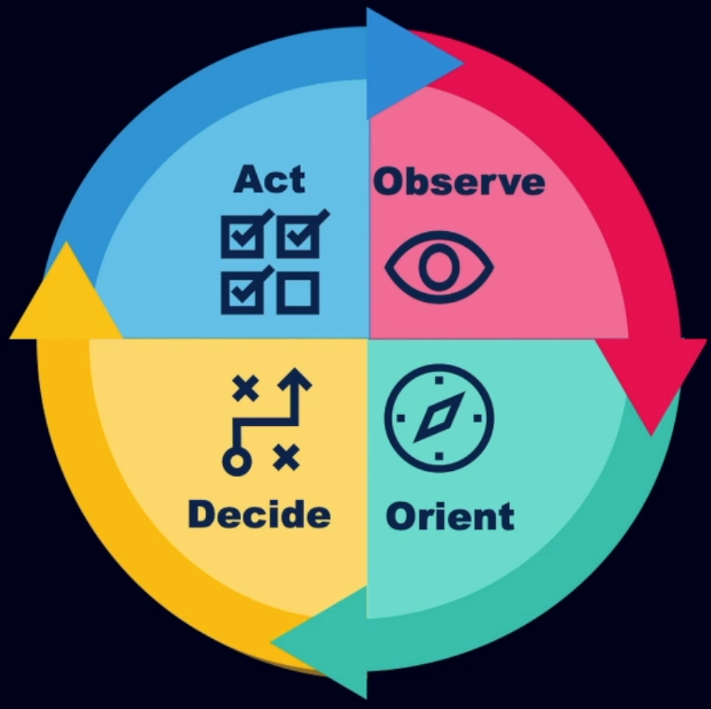

# Responding to a Cyber Incident

## Exercise your plan ! 

You need to practice your IR plans through tabletop exercices.
Train and make sure your training is realistic so that when the incident happen you know what to do, and the roles and responsabilities of your team members. 

It helps highlight all the gaps in the program.

## OODA Loop

- Consider frameworks for your IR team

- OODA: Observe, Orient, Decide, Act is a greate framework to use

## Checklists

Use checklists... there is a reason pilots do!
Train people on them and make sure they use them.

### Checklists to consider

- IR team lead
- Communications
- Offsite response
- CIRT manager
- IT (system admins, network admins, etc.) 

## Sample Playbook - Phishing

## Order of Volatility  - Memory Collection

Memory => System Information => Network Data => Processes & Drivers

## Determining Scope

- Consider a spreadsheet to track affected hosts:

        - IP
        - Hostname
        - Host OS
        - Host Role
        - Physical Location 

## Response Steps to Consider

- Once scope is determined, make a coordinated simultaenous attempt to remove from network
- Block known attacker command & control (C2) domains
- Block dynamic DNS providers
- Change all compromised passwords
- Rebuild or replace compromised hosts
- Deny uncategorized web traffic
- Patch systems and harden them
- Reconnect and monitor
- If additional malicious activity, restart strategy 

## Roles to Consider Staffing

- Log Collection/Analysis
- CIRT Lead
- Forensics
- Evidence Collection
- Communications
- Scribe
- Malware Reverse Engineer
- Eradication/Recovery

Checklists and RACI can be good for all of those roles.

## RACI, Roles nad Checlists

- Create checklists that are printed and part of your IR plan
- Each role should have a checklist associated with it

## The Diamond Model

## The MITRE att&ck framework

- Detection
- Threat Intelligence
- Assessment and Engineering 
- Adversary Emulation

https://attack.mitre.org/

## Lockheed Martin Attack Kill Chain

https://lockheedmartin.com/en-us/capabilities/cyber/cyber-kill-chain.html

## Who decides about notifications ? 

- Who contacts law enforcements ?
- Who contacts the media ? 
- Who contacts the customers ? 
- Who contacts the people who may have had their informations breached as a result of a cyber incident ? 

It needs to be part of the IR plan and be practiced.
You need to train the C suite as well for these, so they can get used to how they would react in such events.

## Consider Notification Triggers

- Organizations can no longer provide critical services 
- PII has been breached
- Sensitive data has been breached
- An insider threat is suspected

## Example of Individuals to Notify

- CIO
- CISO
- Chief of Staff
- CFO
- Off-duty CIRT members
- General Counsel
- System Owners
- Law Enforcement

## Open Source IOC Tools ( IOC = Indicators Of Compromise ) 

- Fireeye Redline
- Kroll's KAPE
- Yara
- Google Rapid Response
- Kali Linux ( Lots of Forensics tools for IOCs ) 
- SANS SIFT
- RegRipper

## Typical IOCs Used During IR

- IP Addresses
- Domain names
- Process names
- File paths of executables
- Registry changes
- Hash values
- Services
- File names

## Sources of IOCs

- Threat Intelligence
- SIEM
- Compromised host
- Network forensics
- Packet captures
- Theat hunting team

## Deploying IOCs

- Most IR teams maintain lists of IOCs that are scanned for by SIEMs or other devices
- IOC scans can be done proactively, or can be done ad-hoc during an incident
- Enterprise tools can scan for files, services, hash values, communications, and other evidence of IOCs

## Alternative Communications

- Should you use your network if it's compromised ?
- Do you have the ability to send PKI encrypted email ?
- What other forms of comms do you have ? Text message, cell phones, Teams, Slack, Wickr, etc.

## Strategic Communications to Users

Some incidents may dictate that no notifications be given to users

- Homepage of Intranet site
- Service desk greeting
- Email
- Posting messages in common areas
- Phone tree
- Telling people in person
- Mass calls/texts wth communication platform
- Text messages 

## Questions Executives Ask During an Incident

- Now what ?
- What should we disclose ? What are we required to disclose ? 
- How much is this going to cost ?
- What did the attackers take ? 
- How did they get in ?
- What will it take to get IT back to full operations ? 
- What else don't we know about ? 
- How could we have prevented this ? How do we make sure it never happens again ? 
- How could we have been better prepared ? 
- Who were the attackers ? What was their motivation ?

Have a slide dedicated to each question as backup material 

## Have a plan to deal with the media

Common questions include:

- When was the attack discovered ?
- Who was responsible ? 
- Did this happen because you have poor security practices ?
- How did the attack occur ? 
- How widespread is this incident ? 
- What is the impact to your customers ? 
- What data was taken ?
- Who is responsible to the incident ? 

Make sure to prep any media relations person - including on what NOT to say

## Containment Strategy

Consider two strategies: disconnect or watch and learn

- The potential for additional damage or exfiltration of data
- What is the need to preserve evidence ? 
- The criticality of the impacted system(s) to the mission
- The effectiveness of the containment strategy
- The duration of the solution

## Decision Matrix 

## Network Isolation

- May be as simple as removing a single host from the network or disconnecting the entire enterprise from the internet
- Consider architecture capabilities and remediation VLANs, etc.
- VLANs may allow for certain communications to occur and may not put the attacker on notice

## Risks of Watch-and-learn

- The CIRT most likely will not know all the capabilities of the attacker
- Insufficient monitoring capabilities to capture attackers every move
- Legal liability if sensitive data is exposed
- Attack surface could increase and worsen eradication issues

## Evidence Collection

Consider assigning the collection of evidence to one person

- Have checklists for potential sources of evidence
- Ensure evidence has not been tampered with prior to collection
- Protect evidence from tampering after collection
- Document who collected it, from where, and the date/time
- Utilize chain of custody forms
- Have a secure location to store logical and physical evidence

## Chain of custody

- The collection of digital evidence is frequently attacked in legal proceedings
- Ensuring digital evidence is collected in a forensically sound manner and documented
- Make sure the CIRT is trained and understands how to handle digital evidence
- Have retention policies

## Notifying Law Enforcement (LE)

- Know who to call before there is an actual incident
- Local police departments often lack cyber resources
- There may be legal or regulatory requirements for notifications
- Typically federal LE is the best option including the FBI, DHS (US-CERT), or URSS
- Consider looking for local FBI Infraguard chapters

## What to expect from LE 

- LE is overwhelmed and under-resourced in cybercrime
- They may provide a case number and that is it
- Don't expect LE to respond or get actively involved unless there are unique circumstances
- If they do get involved, they will not take over but they may provide guidance and suggestions. Remember, their motivation is different than the organizations so be cautious of altering from the IR plan

## Benefits of working with LE 

- They may be able to obtain additional records and evidence (e.g., ISP records, billing records, etc.) 
- LE involvement may buy some time in regulatory reporting requirements
- LE may handle evidence collection
- LE involvement may give the CIRT investigation credibility
- Information sharing and assisting others with IOCs
